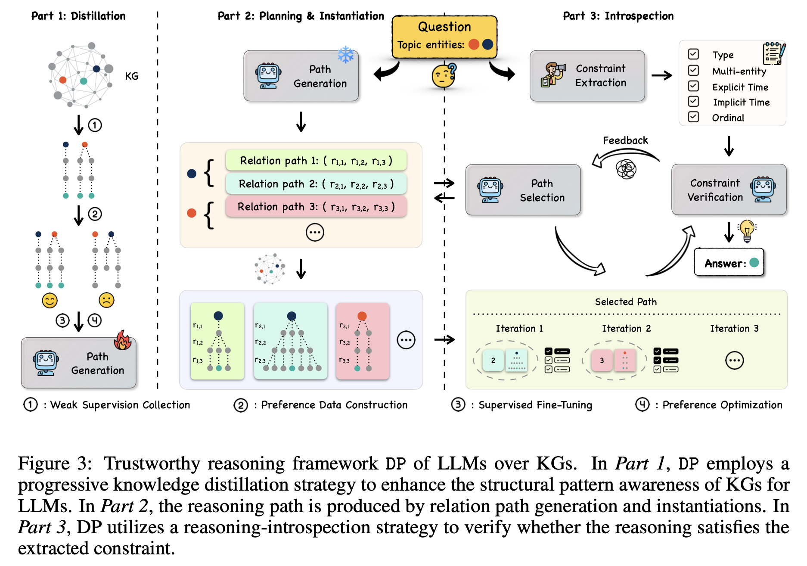

# Deliberation-on-Priors (Anonymous Submission)

<p align="center">
  
</p>

This repository contains the source code for our NeurIPS 2025 submission, currently under double-blind review.

## 🛠️ Project Structure

```bash
.
├── images/              # Framework images and figures
├── utils/               # Utility functions
├── models/              # Core model components
├── data/                # Data
├── data_process/        # Data loading and preprocessing
├── scripts/             # Shell scripts for running experiments
├── main.py              # Entry point script (if applicable)
├── requirements.txt     # Dependency list
└── README.md            # This file
```

## 🚀 Getting Started

### 1. Installation

```bash
pip install -r requirements.txt
```

### 2. Dataset Preparation
We use three benchmark datasets in our experiments: **WebQSP**, **ComplexWebQuestions (CWQ)**, and **MetaQA**.

- For **WebQSP** and **CWQ**, we adopt the same preprocessing protocol as previous studies, and directly use the preprocessed datasets released by [RoG](https://arxiv.org/abs/2310.01061). These datasets follow standard subgraph extraction methods established in [prior work](https://github.com/RichardHGL/WSDM2021_NSM/tree/main/preprocessing/Freebase).

  - [RoG-WebQSP](https://huggingface.co/datasets/rmanluo/RoG-webqsp)
  - [RoG-CWQ](https://huggingface.co/datasets/rmanluo/RoG-cwq)

  Please download the datasets and place them under the `data/` directory:

```bash
data/
├── RoG-webqsp/
└── RoG-cwq/
```
- For **MetaQA**, adaddad.

### 3. Training
During **Distillation** stage, our model is implemented and trained using the [LLaMA-Factory](https://github.com/hiyouga/LLaMA-Factory)framework — a clean, modular, and extensible framework for fine-tuning large language models.

To reproduce our training setup, first clone and set up LLaMA-Factory and configure the environment as follows:
```bash
git clone --depth 1 https://github.com/hiyouga/LLaMA-Factory.git
cd LLaMA-Factory
pip install -e ".[torch,metrics]"
```
Then, you can refer to the key configuration we provide under the `config/` directory of this repository:

```bash
./config/dataset_info.json
./config/llama3_lora_sft.yaml
./config/llama3_lora_kto.yaml
```
You can refer to these configuration files to run SFT and KTO directly within the LLaMA-Factory framework.
Each file specifies task-related settings such as dataset path, learning rate, batch size, LoRA parameters, etc.

### 4. 


