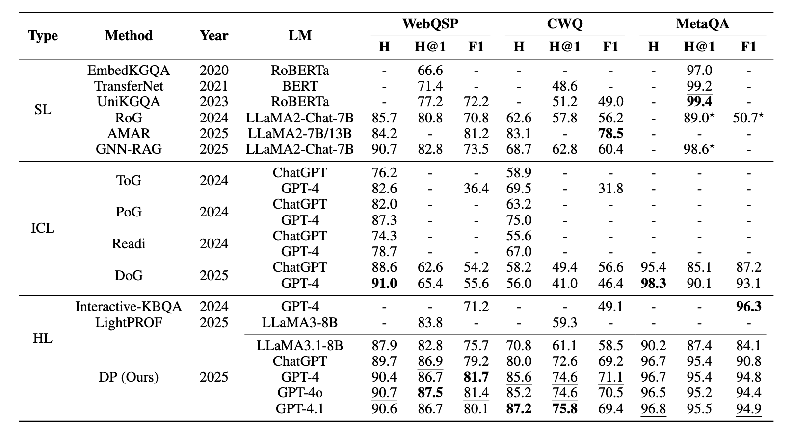

# Deliberation-on-Priors (Anonymous Submission)

<p align="center">
  <strong>Deliberation on Priors: Trustworthy Reasoning of Large Language Models on Knowledge Graphs</strong>
</p>

<p align="center">
  
</p>

This repository contains the source code for our NeurIPS 2025 submission, currently under double-blind review.

## 🛠️ Project Structure

```bash
.
├── config/                    # Configuration files for training/inference
├── data/                      # Input/output data files (JSONL, results, etc.)
├── data_process/              # Data loading and preprocessing scripts
│   └── load_data.py
├── images/                    # Figures (e.g., framework diagram)
│   └── framework.png
├── scripts/                   # Main reasoning stage scripts
│   ├── instance.py            # Instantiation stage
│   ├── path_generation.py     # Path generation via vLLM
│   └── reasoning.py           # Introspection stage (path selection & verification)
├── utils/                     # Common utility functions
│   ├── common_func.py
│   ├── create_graph.py
│   ├── parse.py
│   ├── prompt_template_list.py
│   ├── statics_caculate.py
│   └── __init__.py
├── LICENSE
├── README.md
└── requirements.txt           # Environment dependencies
```

## 🚀 Getting Started

### 1. Installation

```bash
pip install -r requirements.txt
```

### 2. Dataset Preparation
We use three benchmark datasets in our experiments: **WebQSP**, **ComplexWebQuestions (CWQ)**, and **MetaQA**.

- For **WebQSP** and **CWQ**, we adopt the same preprocessing protocol as previous studies, and directly use the preprocessed datasets released by [RoG](https://arxiv.org/abs/2310.01061). These datasets follow standard subgraph extraction methods established in [prior work](https://github.com/RichardHGL/WSDM2021_NSM/tree/main/preprocessing/Freebase).

  - [RoG-WebQSP](https://huggingface.co/datasets/rmanluo/RoG-webqsp)
  - [RoG-CWQ](https://huggingface.co/datasets/rmanluo/RoG-cwq)

  Please download the datasets and place them under the `data/` directory:

```bash
data/
├── RoG-webqsp/
└── RoG-cwq/
```
- For **MetaQA**, we load the dataset directly from its original source and apply our own preprocessing.

### 3. Training
During ***Distillation*** stage, our model is implemented and trained using the [LLaMA-Factory](https://github.com/hiyouga/LLaMA-Factory)framework — a clean, modular, and extensible framework for fine-tuning large language models.

To reproduce our training setup, first clone and set up LLaMA-Factory and configure the environment as follows:
```bash
git clone --depth 1 https://github.com/hiyouga/LLaMA-Factory.git
cd LLaMA-Factory
pip install -e ".[torch,metrics]"
```
Then, you can refer to the key configuration we provide under the `config/` directory of this repository:

```bash
./config/dataset_info.json
./config/llama3_lora_sft.yaml
./config/llama3_lora_kto.yaml
```
You can refer to these configuration files to run SFT and KTO directly within the LLaMA-Factory framework.
Each file specifies task-related settings such as dataset path, learning rate, batch size, LoRA parameters, etc.

### 4. Reasoning
To simplify experiments and clearly separate modules, we conduct the ***Planning*** and ***Instantiation*** stages of reasoning in an offline manner.
#### a. Planning
In ***Planning*** stage, we use the model fine-tuned during the ***distillation*** stage to generate multi-hop reasoning paths for a given question and topic entities.

To accelerate decoding, we adopt [vLLM](https://github.com/vllm-project/vllm) for efficient batch inference.
```bash
CUDA_VISIBLE_DEVICES=0 python -m vllm.entrypoints.openai.api_server --dtype bfloat16 --api-key llama --gpu-memory-utilization 0.9 --tensor-parallel-size 1 --trust-remote-code --port 8000 --model /path/to/your/fine-tuned_model
```

Then, run the following script to perform path generation:
```bash
python scripts/path_generation.py \
    --input_files ./data/test_webqsp.jsonl ./data/test_cwq.jsonl \
    --output_files ./output/webqsp_paths.jsonl ./output/cwq_paths.jsonl \
    --api_key llama \
    --model_name_or_path /path/to/your/fine-tuned_model \
    --base_url http://localhost:8000/v1
```

#### b. Instantiation
The ***Instantiation*** stage takes the generated paths from the previous step as input.
It instantiates each relation path into concrete knowledge graph triplets using a pre-extracted subgraph, and determines which paths are valid (i.e., successfully grounded) and which are not.

```bash
python scripts/instance.py \
  --input_path your/input_file/path \
  --graph_dataset_dir path/to.graph_dataset \
  --output_path your/output_file/path
```

#### c. Introspection
This stage performs iterative path selection and constraint verification.
Constraints are extracted once, and the model repeatedly selects and verifies paths until the constraints are satisfied or no paths remain.

```bash
export API_KEY="sk-xxxx"
```
```bash
python scripts/reasoning.py \
  --model_id "4.1" \
  --api_key ${API_KEY} \
  --base_url "your base url" \
  --input_paths your/input_file/path \
  --output_dir your/output_folder/path \
  --log_prefix "log" \
  --num_repeat 1
```

### 5. Result

<p align="center">
  
</p>

## 📌 Notes

- This repository is anonymized for double-blind review.  
- All results can be reproduced using the provided scripts and configuration files.  
- Please refer to each stage’s section above for detailed instructions.  
- For any questions during review, clarifications will be made in the rebuttal phase.

